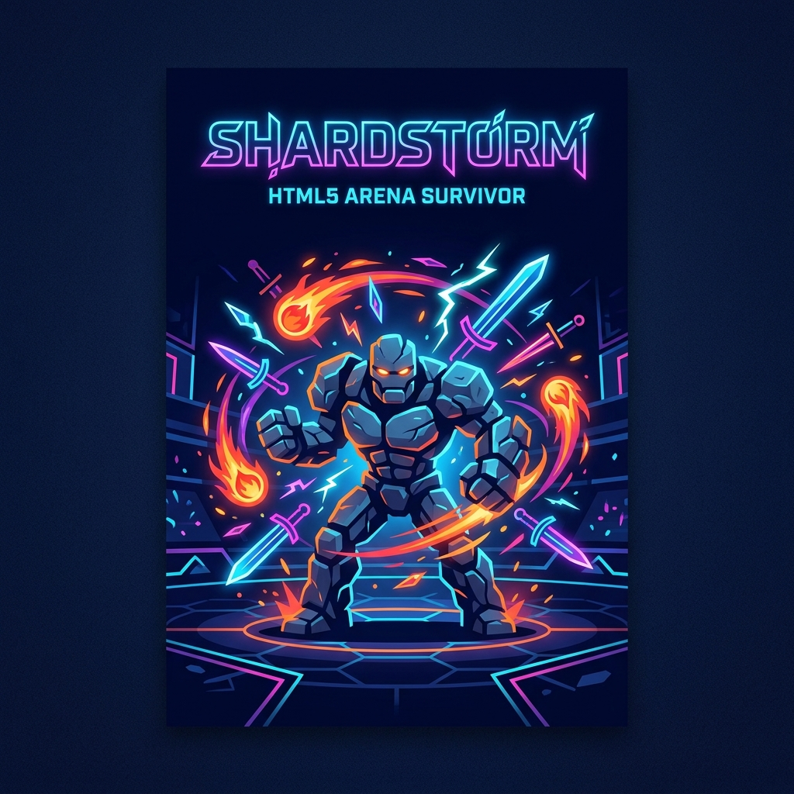

  
  
  <h1>Shardstorm</h1>
  
<strong>An Addictive Hybrid-Casual Arena Survivor & Merge Roguelite Game</strong>

  
  

---

## 🎮 About The Game
**Shardstorm** is a high-octane arena survivor game that blends auto-attacking action with strategic merge mechanics. Step into the arena as the ancient **Forge Golem**. You don't bring weapons to the fight—your enemies *are* your weapons!

Every defeated enemy drops a weapon fragment. These fragments instantly forge into **Relics** that orbit your character and attack automatically. Collect matching Relics to auto-merge them into higher tiers and unleash devastating magical powers!

### ✨ Key Features
- **Dynamic Relic Merging:** 6 unique weapon types with 5 escalating tiers. Merge fragments on the fly to build an unstoppable orbit of destruction.
- **Roguelite Meta-Progression:** Earn gold, unlock pets with unique abilities, and purchase permanent upgrades from the Meta Shop to get stronger every run.
- **Endless Scaling Difficulty:** The arena never stops. Face increasingly difficult swarms and challenging bosses that spawn every two minutes.
- **Procedural Vector Art:** Stunning flat vector minimalism with neon accents, dynamic particle effects, and juicy animations—all rendered efficiently on the web canvas.
- **Cross-Platform & Mobile Ready:** Fully playable on Desktop (WASD/Arrows) and Mobile (Touch Joystick & Dash).

---

## 🚀 How to Play
- **Move:** Use `W A S D` or `Arrow Keys` (Desktop) / `Virtual Joystick` (Mobile).
- **Dash:** Press `Space` or `Shift` (Desktop) / `Double Tap` (Mobile) to dodge enemies and re-spin your Relic ring.
- **Survive:** Your Relics will attack automatically. Pick up XP to level up and draft powerful upgrades!

---

## 🛠️ Tech Stack
Built entirely for the web with performance in mind:
- **Engine:** Phaser 3
- **Language:** Vanilla JavaScript (ES6 Modules)
- **Audio:** WebAudio Synthesized SFX (Zero external audio files)
- **Target:** Smooth 60 FPS performance on both mid-range mobile devices and desktop browsers.

---

  <i>Developed with ❤️ by Mustafa Bakoğlu.</i>

